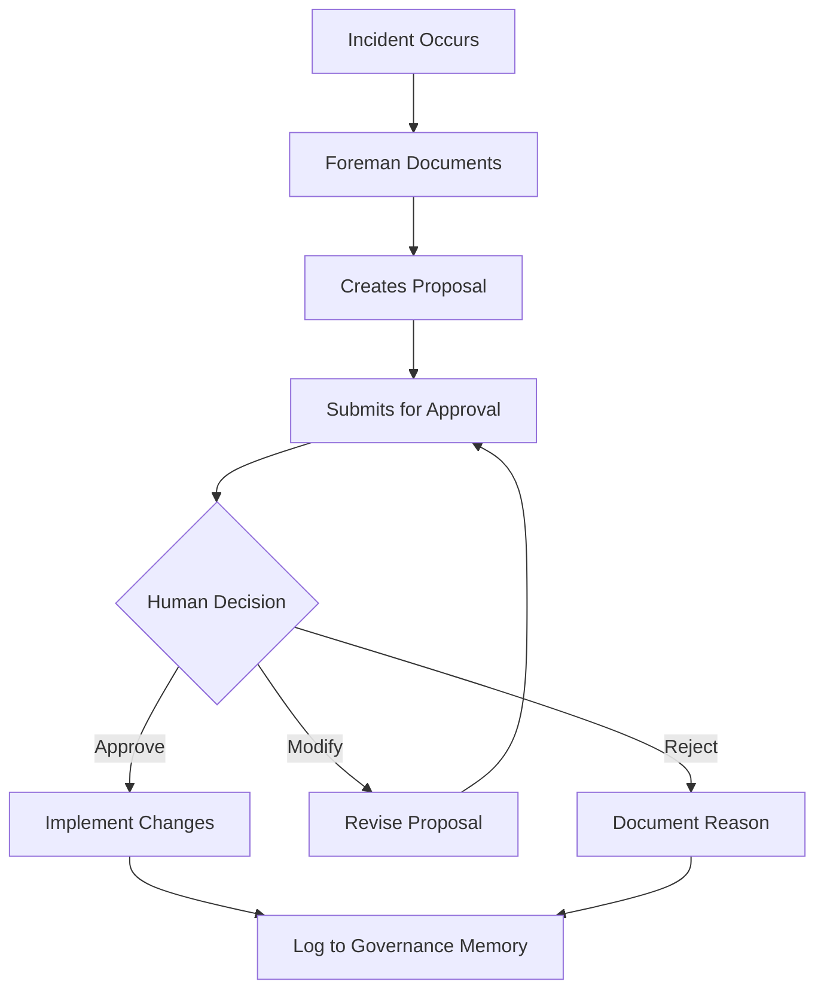

# FL/CI Learning System - Implementation Summary

## Overview

This document describes the **explicit, auditable, and governed** FL/CI (Feedback Loop / Continuous Improvement) learning system implemented in response to the constitutional requirement:

> "FL/CI learning is required, but must be explicit, auditable, and governed—never silent or heuristic-only."

---

## Constitutional Compliance

### Requirements Met

1. ✅ **EXPLICIT**: All learnings documented in markdown files
   - Full context and incident details
   - Root cause analysis
   - Proposed resolutions
   - Evidence links

2. ✅ **AUDITABLE**: Complete audit trail maintained
   - Governance log tracks all submissions
   - Timestamps for all actions
   - Evidence links (commits, PRs, issues)
   - Approval/rejection decisions recorded

3. ✅ **GOVERNED**: Human approval required
   - Cannot self-approve changes
   - Owner (Johan) must approve/reject
   - Modifications can be requested
   - Implementation only after approval

4. ✅ **NEVER SILENT**: All changes visible
   - Repository commits
   - PR descriptions
   - Governance Memory logs
   - Public audit trail

---

## System Architecture

### Directory Structure

```
/foreman/lessons-learned/
├── README.md                    # System documentation and governance requirements
├── governance-log.md            # Auditable log of all approvals/rejections
└── [ID]-[description].md        # Individual lesson learned documents
```

### Document Template

Each lesson learned includes:
- Incident ID (unique identifier)
- Metadata (date, severity, status)
- Incident summary
- Impact analysis
- Root cause analysis
- Resolution (immediate fix)
- Prevention proposal (systemic fix)
- Approval decision section
- Audit trail

### Approval Workflow



---

## Integration with Build Philosophy

### Learning Loop

1. **Incident Detection**: System detects failure or issue
2. **Root Cause Analysis**: Foreman analyzes what went wrong
3. **Documentation**: Create explicit lesson learned document
4. **Proposal**: Suggest changes to prevent recurrence
5. **Submission**: Log to governance-log.md with PENDING status
6. **Human Review**: Owner reviews and decides
7. **Implementation**: If approved, make documented changes
8. **Validation**: Verify changes prevent issue
9. **Closure**: Update governance log with implementation status

### Build Philosophy Updates

Approved learnings may result in updates to:
- `/BUILD_PHILOSOPHY.md` - Core build process
- `/foreman/architecture-design-checklist.md` - Architecture requirements
- `/foreman/qa/quality-integrity-contract.md` - Quality standards
- `/foreman/builder-specs/*.md` - Builder specifications
- Other constitutional documents as needed

---

## First Lesson Learned

### ID: 001-typescript-compilation-validation

**Incident**: Deployment failure due to TypeScript compilation errors

**Status**: PENDING_APPROVAL (awaiting Johan)

**Proposal**: Add compilation validation gate to Build Philosophy

**Location**: `/foreman/lessons-learned/001-typescript-compilation-validation.md`

**Key Points**:
- Red QA tests must compile (can fail at runtime)
- Add Step 2.5: Compilation Validation to Build Philosophy
- Enhance architecture checklist with TypeScript requirements
- Add QIC-8: TypeScript Integrity
- Create Red QA test writing standards

---

## Governance Rules

### Approval Authority

**Only humans can approve lessons learned**:
- Johan (Owner) - Primary authority
- Designated technical leads (as specified by Johan)

**Foreman cannot**:
- Self-approve any learning
- Bypass approval process
- Implement changes before approval
- Modify approved learnings without re-approval

### Submission Requirements

To submit a lesson learned, Foreman must:
1. Document full incident with evidence
2. Perform root cause analysis
3. Propose specific, actionable changes
4. Create governance log entry
5. Tag human for review
6. Wait for approval decision

### Implementation Requirements

After approval, Foreman must:
1. Make only the approved changes
2. Create PR for human review
3. Log implementation to Governance Memory
4. Update governance log with completion status
5. Validate changes achieve intended effect

---

## Monitoring and Metrics

### Success Metrics

- **Lessons Submitted**: Count of documented learnings
- **Approval Rate**: Percentage approved vs rejected
- **Implementation Time**: Time from approval to completion
- **Recurrence Prevention**: Incidents prevented by learnings
- **Audit Trail Completeness**: 100% of learnings fully documented

### Current Status

- **Total Lessons**: 1
- **Pending Approval**: 1
- **Approved**: 0
- **Rejected**: 0
- **Implemented**: 0

---

## Anti-Patterns (What This System PREVENTS)

### ❌ Silent Heuristic Updates
**Bad**: System automatically adjusts behavior based on patterns
**Good**: System documents pattern, proposes change, awaits approval

### ❌ Implicit Learning
**Bad**: Code changes without documented reasoning
**Good**: Every change has explicit lesson learned document

### ❌ Autonomous Self-Modification
**Bad**: Foreman modifies Build Philosophy without approval
**Good**: Foreman proposes changes, human approves/rejects

### ❌ Ungoverned Evolution
**Bad**: System evolves based on unsupervised learning
**Good**: All evolution requires human governance

---

## Benefits

### For Governance
- Complete visibility into system learning
- Human control over constitutional changes
- Audit trail for compliance
- Accountability and traceability

### For Quality
- Systematic root cause analysis
- Prevention of recurring issues
- Continuous improvement with oversight
- Evidence-based decision making

### For Team
- Shared knowledge of incidents
- Documented resolutions
- Learning from failures
- Improved processes over time

---

## Future Enhancements

### Potential Additions
1. Severity-based approval routing
2. Automatic notification to approvers
3. Deadline tracking for pending approvals
4. Metrics dashboard for learning trends
5. Search/query interface for lessons
6. Integration with incident management system

### Governance Considerations
All enhancements must:
- Maintain human approval requirement
- Preserve audit trail completeness
- Keep learnings explicit and visible
- Never introduce silent automation

---

## Conclusion

This FL/CI learning system ensures that the Maturion ecosystem learns and improves **transparently, with human oversight, and complete accountability**.

Every lesson is:
- **Documented** (explicit)
- **Logged** (auditable)
- **Approved** (governed)
- **Visible** (never silent)

This is the foundation for continuous improvement that respects governance boundaries and maintains human control.

---

**Version**: 1.0  
**Date**: 2025-12-13  
**Status**: Active and Enforced  
**Authority**: Constitutional Requirement  
**Maintained By**: Foreman under Human Governance
